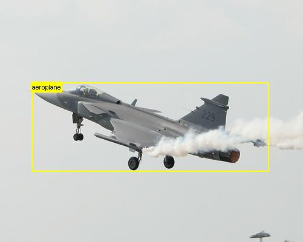
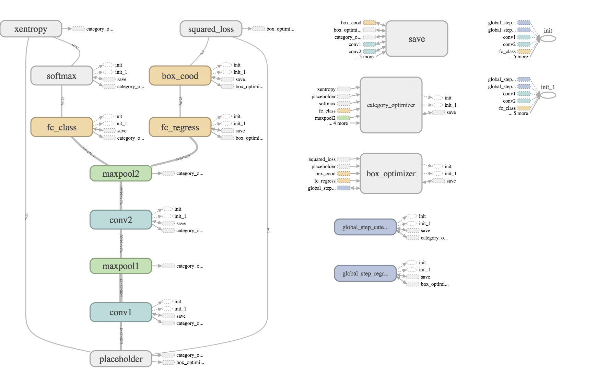

# LocaliseNet
Object Localisation Using ConvNet

## About this project
Object localisation is one of the important task of computer vision. Under this task, the aim is to classify the image and provide the coordinates of a rectangular box around the object of interest. To solve this problem, I used a simple Convolution Neural Network with two heads mounted upon the series of conv-maxpool layer. One of the heads performs the classification of the image according to the 20 categories found in the VOC 2007 dataset. The other head performs regression to compute the coordinates of the rectangular box. The ConvNet consists of two convolution layer with relu non linearity and max pool layers.

## About the dataset
The goal of this dataset is to recognize objects from a number of visual object classes in realistic scenes (i.e. not pre-segmented objects. The twenty object classes that have been selected are:

* Person: person
* Animal: bird, cat, cow, dog, horse, sheep
* Vehicle: aeroplane, bicycle, boat, bus, car, motorbike, train
* Indoor: bottle, chair, dining table, potted plant, sofa, tv/monitor


## Tasks

* Classification: For each of the twenty classes, predicting presence/absence of an example of that class in the test image.
* Detection: Predicting the bounding box and label of each object from the twenty target classes in the test image.

The image below illustrates the task in order



## System Requirements

```
Python v2.7.x
TensorFlow v1.1
Numpy
Pandas
tqdm (Progress bar)
Jupyter Notebook (Visualisations)
VOC 2007 Dataset
```

## Running the code

* Download from http://host.robots.ox.ac.uk/pascal/VOC/voc2007/
* Clone the repository
```
git clone https://github.com/najeeb97khan/LocaliseNet.git
```
* Open utils/generate_voc.py and change the path to point to your dataset
* Run generate_voc.py
```
python generate_voc.py
```
* Open train.py and change the path to point to the dataset
* Construct folders in the project directory namely **checkpoints/two\_layer** and **checkpoints/two\_layer_reg** for storing model checkpoints
* Construct a folder named **graphs** to store the definition of graph
* Run train.py
```
python train.py
```
* To assess the accuracy of the trained model on training dataset (or any other dataset of your choice)
```
python predict.py
```

## Model Specifications

As specified earlier the model consist of two layer convolution network with a regression and a classification head. Following is the illustration of computation graph



## Author Information

* **Najeeb Khan** - najeeb97khan.github.io

## Shoutout to

* Stanford CS20SI for Tensorflow
* CS231n for Object Localisation techniques
* The PASCAL Visual Object Classes Challange 2007 for Dataset
